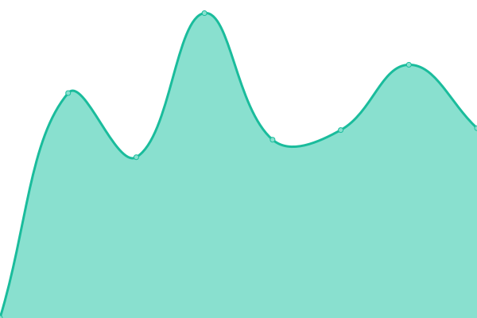
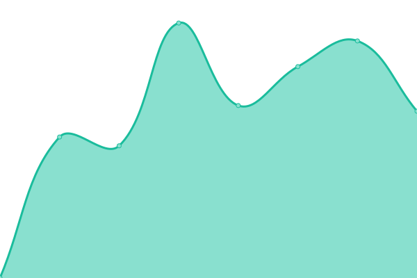
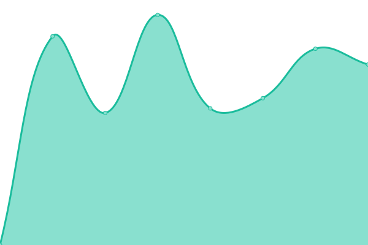

# [📈 Live Status](https://staus.worldofplayers.de): <!--live status--> **🟩 All systems operational**

This repository contains the open-source uptime monitor and status page for [World of Players](https://www.worldofplayers.de/), powered by [Upptime](https://github.com/upptime/upptime).

With [Upptime](https://upptime.js.org), you can get your own unlimited and free uptime monitor and status page, powered entirely by a GitHub repository. We use [Issues](https://github.com/worldofplayers/status/issues) as incident reports, [Actions](https://github.com/worldofplayers/status/actions) as uptime monitors, and [Pages](https://staus.worldofplayers.de) for the status page.

<!--start: status pages-->
<!-- This summary is generated by Upptime (https://github.com/upptime/upptime) -->
<!-- Do not edit this manually, your changes will be overwritten -->
<!-- prettier-ignore -->
| URL | Status | History | Response Time | Uptime |
| --- | ------ | ------- | ------------- | ------ |
|  [Forum](https://forum.worldofplayers.de/forum/forums/146-Infoforum) | 🟩 Up | [forum.yml](https://github.com/worldofplayers/status/commits/HEAD/history/forum.yml) | 

 2519ms
     
 | 

<a href="https://status.worldofplayers.de/history/forum">100.00%</a>
    

|  [Portalseite](https://www.worldofplayers.de/) | 🟩 Up | [portalseite.yml](https://github.com/worldofplayers/status/commits/HEAD/history/portalseite.yml) | 

 1253ms
     
 | 

<a href="https://status.worldofplayers.de/history/portalseite">100.00%</a>
    

|  [World of Gothic](https://www.worldofgothic.de/) | 🟩 Up | [world-of-gothic.yml](https://github.com/worldofplayers/status/commits/HEAD/history/world-of-gothic.yml) | 

 1594ms
     
 | 

<a href="https://status.worldofplayers.de/history/world-of-gothic">100.00%</a>
    

|  [The Witcher](https://www.the-witcher.de/) | 🟩 Up | [the-witcher.yml](https://github.com/worldofplayers/status/commits/HEAD/history/the-witcher.yml) | 

 2090ms
     
 | 

<a href="https://status.worldofplayers.de/history/the-witcher">100.00%</a>
    

<!--end: status pages-->

[**Visit our status website →**](https://staus.worldofplayers.de)

## 📄 License

- Powered by: [Upptime](https://github.com/upptime/upptime)
- Code: [MIT](./LICENSE) © [World of Players](https://www.worldofplayers.de/)
- Data in the `./history` directory: [Open Database License](https://opendatacommons.org/licenses/odbl/1-0/)
