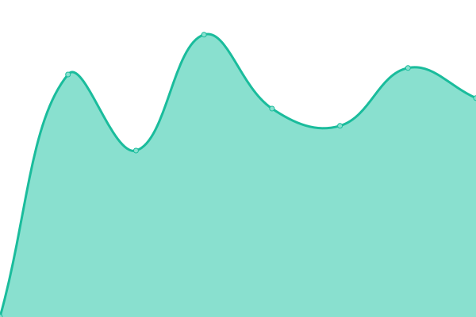
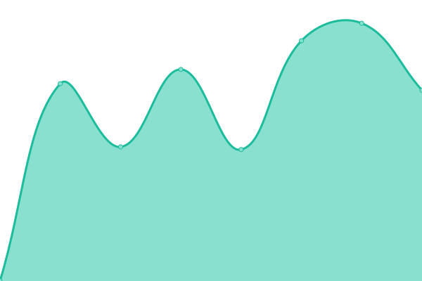
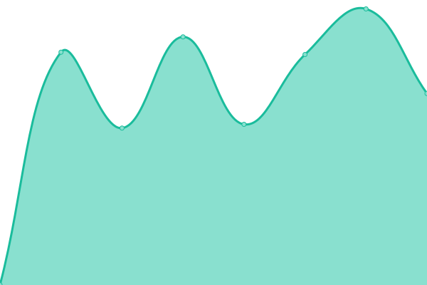
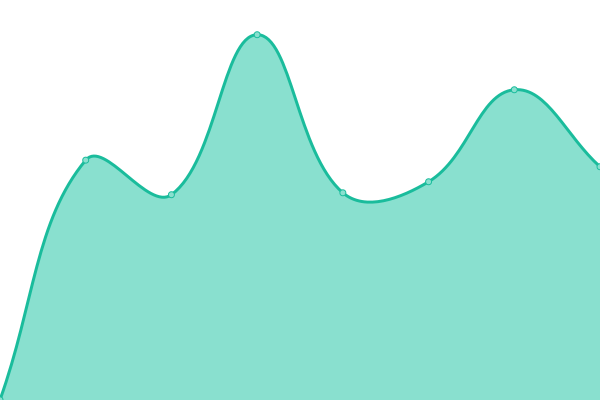

# [📈 Live Status](https://status.worldofplayers.de): <!--live status--> **🟩 All systems operational**

This repository contains the uptime monitor and status page for [World of Players](https://www.worldofplayers.de/).

We use [Issues](https://github.com/worldofplayers/status/issues) as incident reports, [Actions](https://github.com/worldofplayers/status/actions) as uptime monitors, and [Pages](https://status.worldofplayers.de) for the status page.

<!--start: status pages-->
<!-- This summary is generated by Upptime (https://github.com/upptime/upptime) -->
<!-- Do not edit this manually, your changes will be overwritten -->
<!-- prettier-ignore -->
| URL | Status | History | Response Time | Uptime |
| --- | ------ | ------- | ------------- | ------ |
|  [Forum](https://forum.worldofplayers.de/forum/forums/146-Infoforum) | 🟩 Up | [forum.yml](https://github.com/worldofplayers/status/commits/HEAD/history/forum.yml) | 

 2155ms
     
 | 

<a href="https://status.worldofplayers.de/history/forum">100.00%</a>
    

|  [Portalseite](https://www.worldofplayers.de/) | 🟩 Up | [portalseite.yml](https://github.com/worldofplayers/status/commits/HEAD/history/portalseite.yml) | 

 1168ms
     
 | 

<a href="https://status.worldofplayers.de/history/portalseite">100.00%</a>
    

|  [Download-Server](https://dl.worldofplayers.de/wog/gothic1/sonstiges/GothicFps-108.zip) | 🟩 Up | [download-server.yml](https://github.com/worldofplayers/status/commits/HEAD/history/download-server.yml) | 

 1532ms
     
 | 

<a href="https://status.worldofplayers.de/history/download-server">100.00%</a>
    

|  [Upload-Server](https://upload.worldofplayers.de/files12/testbild.png) | 🟩 Up | [upload-server.yml](https://github.com/worldofplayers/status/commits/HEAD/history/upload-server.yml) | 

 852ms
     
 | 

<a href="https://status.worldofplayers.de/history/upload-server">100.00%</a>
    

|  [Upload-Server (Upload Form)](https://upload.worldofplayers.de/) | 🟩 Up | [upload-server-upload-form.yml](https://github.com/worldofplayers/status/commits/HEAD/history/upload-server-upload-form.yml) | 

 1968ms
     
 | 

<a href="https://status.worldofplayers.de/history/upload-server-upload-form">100.00%</a>
    

|  [Assassin's Creed](https://www.assassins-creed.de/) | 🟩 Up | [assassin-s-creed.yml](https://github.com/worldofplayers/status/commits/HEAD/history/assassin-s-creed.yml) | 

 1205ms
     
 | 

<a href="https://status.worldofplayers.de/history/assassin-s-creed">100.00%</a>
    

|  [Diablo Game](https://www.diablogame.de/) | 🟩 Up | [diablo-game.yml](https://github.com/worldofplayers/status/commits/HEAD/history/diablo-game.yml) | 

 1632ms
     
 | 

<a href="https://status.worldofplayers.de/history/diablo-game">100.00%</a>
    

|  [Dragon Age Game](https://www.dragonage-game.de/) | 🟩 Up | [dragon-age-game.yml](https://github.com/worldofplayers/status/commits/HEAD/history/dragon-age-game.yml) | 

 1268ms
     
 | 

<a href="https://status.worldofplayers.de/history/dragon-age-game">100.00%</a>
    

|  [DSA Drakensang](https://www.dsa-drakensang.de/) | 🟩 Up | [dsa-drakensang.yml](https://github.com/worldofplayers/status/commits/HEAD/history/dsa-drakensang.yml) | 

 1364ms
     
 | 

<a href="https://status.worldofplayers.de/history/dsa-drakensang">100.00%</a>
    

|  [Dungeon Lords](https://www.dungeon-lords.de/) | 🟩 Up | [dungeon-lords.yml](https://github.com/worldofplayers/status/commits/HEAD/history/dungeon-lords.yml) | 

 1204ms
     
 | 

<a href="https://status.worldofplayers.de/history/dungeon-lords">100.00%</a>
    

|  [Fallout-Area.de](https://fallout-area.de) | 🟩 Up | [fallout-area-de.yml](https://github.com/worldofplayers/status/commits/HEAD/history/fallout-area-de.yml) | 

 1535ms
     
 | 

<a href="https://status.worldofplayers.de/history/fallout-area-de">100.00%</a>
    

|  [Herr der Ringe](https://www.hdr-seite.de) | 🟩 Up | [herr-der-ringe.yml](https://github.com/worldofplayers/status/commits/HEAD/history/herr-der-ringe.yml) | 

 2030ms
     
 | 

<a href="https://status.worldofplayers.de/history/herr-der-ringe">100.00%</a>
    

|  [Mass Effect Universe](https://www.masseffect-universe.de/) | 🟩 Up | [mass-effect-universe.yml](https://github.com/worldofplayers/status/commits/HEAD/history/mass-effect-universe.yml) | 

 1465ms
     
 | 

<a href="https://status.worldofplayers.de/history/mass-effect-universe">100.00%</a>
    

|  [Planet Neverwinter](https://www.planetneverwinter.de/) | 🟩 Up | [planet-neverwinter.yml](https://github.com/worldofplayers/status/commits/HEAD/history/planet-neverwinter.yml) | 

 1890ms
     
 | 

<a href="https://status.worldofplayers.de/history/planet-neverwinter">100.00%</a>
    

|  [Sacred Legends](https://www.sacred-legends.de/) | 🟩 Up | [sacred-legends.yml](https://github.com/worldofplayers/status/commits/HEAD/history/sacred-legends.yml) | 

 1320ms
     
 | 

<a href="https://status.worldofplayers.de/history/sacred-legends">100.00%</a>
    

|  [The Witcher](https://www.the-witcher.de/) | 🟩 Up | [the-witcher.yml](https://github.com/worldofplayers/status/commits/HEAD/history/the-witcher.yml) | 

 2217ms
     
 | 

<a href="https://status.worldofplayers.de/history/the-witcher">99.74%</a>
    

|  [World of Cyberpunk](https://www.worldofcyberpunk.de) | 🟩 Up | [world-of-cyberpunk.yml](https://github.com/worldofplayers/status/commits/HEAD/history/world-of-cyberpunk.yml) | 

 2416ms
     
 | 

<a href="https://status.worldofplayers.de/history/world-of-cyberpunk">99.74%</a>
    

|  [World of Elder Scrolls](https://www.worldofelderscrolls.de/) | 🟩 Up | [world-of-elder-scrolls.yml](https://github.com/worldofplayers/status/commits/HEAD/history/world-of-elder-scrolls.yml) | 

 1783ms
     
 | 

<a href="https://status.worldofplayers.de/history/world-of-elder-scrolls">99.74%</a>
    

|  [World of Elex](https://worldofelex.de/) | 🟩 Up | [world-of-elex.yml](https://github.com/worldofplayers/status/commits/HEAD/history/world-of-elex.yml) | 

 1642ms
     
 | 

<a href="https://status.worldofplayers.de/history/world-of-elex">99.75%</a>
    

|  [World of Gothic](https://www.worldofgothic.de/) | 🟩 Up | [world-of-gothic.yml](https://github.com/worldofplayers/status/commits/HEAD/history/world-of-gothic.yml) | 

 1748ms
     
 | 

<a href="https://status.worldofplayers.de/history/world-of-gothic">99.75%</a>
    

|  [World of Risen](https://www.worldofrisen.de/) | 🟩 Up | [world-of-risen.yml](https://github.com/worldofplayers/status/commits/HEAD/history/world-of-risen.yml) | 

 1338ms
     
 | 

<a href="https://status.worldofplayers.de/history/world-of-risen">99.76%</a>
    

<!--end: status pages-->

[**Visit our status website →**](https://status.worldofplayers.de)

## 📄 License

- Powered by: [Upptime](https://github.com/upptime/upptime)
- Code: [MIT](./LICENSE) © [World of Players](https://www.worldofplayers.de/)
- Data in the `./history` directory: [Open Database License](https://opendatacommons.org/licenses/odbl/1-0/)
